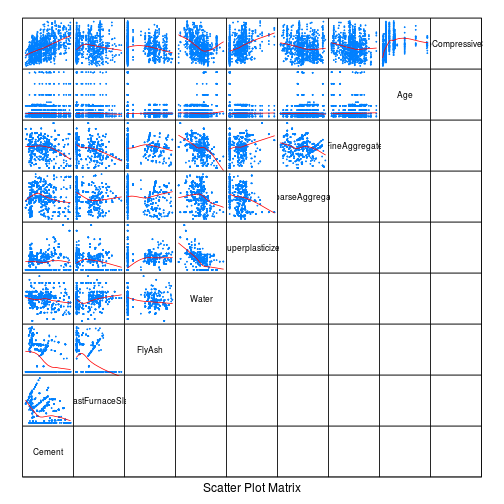

```r
library("knitr")
library("e1071")
library("lattice")
library("corrplot")
library(stats)
library(MASS)
data.concrete <- read.csv("../data/Concrete_Data.csv", comment.char = "#")
check<- function(l){ 
  print(tune(lm, as.formula(l), data = data.concrete, tunecontrol = tune.control(sampling = "fix",fix = 2/3)))
}
model<- function(f){ 
  new_model = lm(as.formula(f),data.concrete)
  return (new_model)
}
```


Посмотрим на общую информацию и стандартные картиночки.

```r
summary(data.concrete)
```

```
##      Cement      BlastFurnaceSlag     FlyAsh           Water      
##  Min.   :102.0   Min.   :  0.0    Min.   :  0.00   Min.   :121.8  
##  1st Qu.:192.4   1st Qu.:  0.0    1st Qu.:  0.00   1st Qu.:164.9  
##  Median :272.9   Median : 22.0    Median :  0.00   Median :185.0  
##  Mean   :281.2   Mean   : 73.9    Mean   : 54.19   Mean   :181.6  
##  3rd Qu.:350.0   3rd Qu.:142.9    3rd Qu.:118.30   3rd Qu.:192.0  
##  Max.   :540.0   Max.   :359.4    Max.   :200.10   Max.   :247.0  
##  Superplasticizer CoarseAggregate  FineAggregate        Age        
##  Min.   : 0.000   Min.   : 801.0   Min.   :594.0   Min.   :  1.00  
##  1st Qu.: 0.000   1st Qu.: 932.0   1st Qu.:731.0   1st Qu.:  7.00  
##  Median : 6.400   Median : 968.0   Median :779.5   Median : 28.00  
##  Mean   : 6.205   Mean   : 972.9   Mean   :773.6   Mean   : 45.66  
##  3rd Qu.:10.200   3rd Qu.:1029.4   3rd Qu.:824.0   3rd Qu.: 56.00  
##  Max.   :32.200   Max.   :1145.0   Max.   :992.6   Max.   :365.00  
##  ConcreteCompressiveStrength
##  Min.   : 2.33              
##  1st Qu.:23.71              
##  Median :34.45              
##  Mean   :35.82              
##  3rd Qu.:46.13              
##  Max.   :82.60
```

```r
splom(~data.concrete, data.concrete,upper.panel=function(x, y, ...) { panel.xyplot(x, y, ...); panel.loess(x, y, ..., col='red') },lower.panel=function(x, y, ...) { },
pscale=0, varname.cex=0.7, par.settings=simpleTheme(pch=13, cex=0.1))
```

 

```r
corrplot.mixed(cor(data.concrete), tl.cex=0.5)
```

 

Видна линейная зависимость от цемента, отсутствие зависимости от FlyAsh.
Видно что Water и FineAggregate/Superplasticizer коррелируют.
Скорее всего стоит факторизовать Age и Water.

строим базовую модель

```r
model1 <- model(ConcreteCompressiveStrength ~ Cement + BlastFurnaceSlag+FlyAsh + Water + Superplasticizer + CoarseAggregate + FineAggregate + Age)
summary(model1)
```

```
## 
## Call:
## lm(formula = as.formula(f), data = data.concrete)
## 
## Residuals:
##     Min      1Q  Median      3Q     Max 
## -28.654  -6.302   0.703   6.569  34.450 
## 
## Coefficients:
##                    Estimate Std. Error t value Pr(>|t|)    
## (Intercept)      -23.331214  26.585504  -0.878 0.380372    
## Cement             0.119804   0.008489  14.113  < 2e-16 ***
## BlastFurnaceSlag   0.103866   0.010136  10.247  < 2e-16 ***
## FlyAsh             0.087934   0.012583   6.988 5.02e-12 ***
## Water             -0.149918   0.040177  -3.731 0.000201 ***
## Superplasticizer   0.292225   0.093424   3.128 0.001810 ** 
## CoarseAggregate    0.018086   0.009392   1.926 0.054425 .  
## FineAggregate      0.020190   0.010702   1.887 0.059491 .  
## Age                0.114222   0.005427  21.046  < 2e-16 ***
## ---
## Signif. codes:  0 '***' 0.001 '**' 0.01 '*' 0.05 '.' 0.1 ' ' 1
## 
## Residual standard error: 10.4 on 1021 degrees of freedom
## Multiple R-squared:  0.6155,	Adjusted R-squared:  0.6125 
## F-statistic: 204.3 on 8 and 1021 DF,  p-value: < 2.2e-16
```

```r
check(model1)
```

```
## 
## Error estimation of 'lm' using fixed training/validation set: 107.984
```

Ошибка достаточно велика, исключим CoarseAggregate, логарифмируем age  и water, т.к. они дискретены.


```r
model2 <- model(ConcreteCompressiveStrength ~ Cement + BlastFurnaceSlag+FlyAsh + log(Water) + Superplasticizer+ FineAggregate + log(Age))
summary(model2)
```

```
## 
## Call:
## lm(formula = as.formula(f), data = data.concrete)
## 
## Residuals:
##      Min       1Q   Median       3Q      Max 
## -22.0063  -4.3984  -0.1838   4.2351  29.8146 
## 
## Coefficients:
##                    Estimate Std. Error t value Pr(>|t|)    
## (Intercept)       1.742e+02  1.695e+01  10.279   <2e-16 ***
## Cement            1.140e-01  3.719e-03  30.660   <2e-16 ***
## BlastFurnaceSlag  9.093e-02  4.261e-03  21.339   <2e-16 ***
## FlyAsh            6.793e-02  6.259e-03  10.853   <2e-16 ***
## log(Water)       -4.142e+01  2.863e+00 -14.467   <2e-16 ***
## Superplasticizer  1.526e-04  6.180e-02   0.002    0.998    
## FineAggregate     9.099e-03  4.135e-03   2.201    0.028 *  
## log(Age)          8.625e+00  1.932e-01  44.645   <2e-16 ***
## ---
## Signif. codes:  0 '***' 0.001 '**' 0.01 '*' 0.05 '.' 0.1 ' ' 1
## 
## Residual standard error: 7.235 on 1022 degrees of freedom
## Multiple R-squared:  0.8137,	Adjusted R-squared:  0.8125 
## F-statistic: 637.8 on 7 and 1022 DF,  p-value: < 2.2e-16
```

```r
check(model2)
```

```
## 
## Error estimation of 'lm' using fixed training/validation set: 52.81598
```
Стало лучше. Для того чтобы определить факторы рассмотрим подробнее Age и Water.


```r
scatter.smooth(data.concrete$Age, data.concrete$ConcreteCompressiveStrength)
```

 

```r
data.concrete$ageFactor<-data.concrete$Age<90
scatter.smooth(data.concrete$Water, data.concrete$ConcreteCompressiveStrength)
```

 

```r
data.concrete$waterFactor<-data.concrete$Water<190
model3 <- model(ConcreteCompressiveStrength ~ Cement + BlastFurnaceSlag+FlyAsh + waterFactor:log(Water) + Superplasticizer+ FineAggregate + ageFactor:log(Age))
summary(model3)
```

```
## 
## Call:
## lm(formula = as.formula(f), data = data.concrete)
## 
## Residuals:
##      Min       1Q   Median       3Q      Max 
## -21.8619  -4.4495  -0.2228   4.4338  29.6343 
## 
## Coefficients:
##                               Estimate Std. Error t value Pr(>|t|)    
## (Intercept)                 145.056099  21.342575   6.797 1.82e-11 ***
## Cement                        0.114798   0.003701  31.014  < 2e-16 ***
## BlastFurnaceSlag              0.090765   0.004246  21.379  < 2e-16 ***
## FlyAsh                        0.065610   0.006249  10.499  < 2e-16 ***
## Superplasticizer             -0.024892   0.061679  -0.404  0.68661    
## FineAggregate                 0.011411   0.004223   2.702  0.00701 ** 
## waterFactorFALSE:log(Water) -36.613226   3.644953 -10.045  < 2e-16 ***
## waterFactorTRUE:log(Water)  -36.323549   3.731516  -9.734  < 2e-16 ***
## ageFactorFALSE:log(Age)       8.696106   0.192425  45.192  < 2e-16 ***
## ageFactorTRUE:log(Age)        9.267803   0.266932  34.720  < 2e-16 ***
## ---
## Signif. codes:  0 '***' 0.001 '**' 0.01 '*' 0.05 '.' 0.1 ' ' 1
## 
## Residual standard error: 7.178 on 1020 degrees of freedom
## Multiple R-squared:  0.817,	Adjusted R-squared:  0.8154 
## F-statistic: 505.9 on 9 and 1020 DF,  p-value: < 2.2e-16
```

```r
check(model3)
```

```
## 
## Error estimation of 'lm' using fixed training/validation set: 48.22613
```

Проверим последние две модели 


```r
model2.aic<-stepAIC(model2)
```

```
## Start:  AIC=4084.43
## ConcreteCompressiveStrength ~ Cement + BlastFurnaceSlag + FlyAsh + 
##     log(Water) + Superplasticizer + FineAggregate + log(Age)
## 
##                    Df Sum of Sq    RSS    AIC
## - Superplasticizer  1         0  53490 4082.4
## <none>                           53490 4084.4
## - FineAggregate     1       253  53743 4087.3
## - FlyAsh            1      6165  59655 4194.8
## - log(Water)        1     10954  64444 4274.3
## - BlastFurnaceSlag  1     23833  77323 4462.0
## - Cement            1     49200 102690 4754.2
## - log(Age)          1    104320 157810 5196.8
## 
## Step:  AIC=4082.43
## ConcreteCompressiveStrength ~ Cement + BlastFurnaceSlag + FlyAsh + 
##     log(Water) + FineAggregate + log(Age)
## 
##                    Df Sum of Sq    RSS    AIC
## <none>                           53490 4082.4
## - FineAggregate     1       271  53761 4085.6
## - FlyAsh            1      8742  62232 4236.3
## - log(Water)        1     14091  67581 4321.3
## - BlastFurnaceSlag  1     30816  84306 4549.0
## - Cement            1     61249 114739 4866.5
## - log(Age)          1    105536 159026 5202.7
```

```r
summary(model2.aic)
```

```
## 
## Call:
## lm(formula = ConcreteCompressiveStrength ~ Cement + BlastFurnaceSlag + 
##     FlyAsh + log(Water) + FineAggregate + log(Age), data = data.concrete)
## 
## Residuals:
##     Min      1Q  Median      3Q     Max 
## -22.006  -4.399  -0.184   4.235  29.814 
## 
## Coefficients:
##                    Estimate Std. Error t value Pr(>|t|)    
## (Intercept)      174.184764  15.943891  10.925   <2e-16 ***
## Cement             0.114019   0.003331  34.226   <2e-16 ***
## BlastFurnaceSlag   0.090931   0.003746  24.277   <2e-16 ***
## FlyAsh             0.067935   0.005254  12.930   <2e-16 ***
## log(Water)       -41.421509   2.523202 -16.416   <2e-16 ***
## FineAggregate      0.009102   0.003995   2.278   0.0229 *  
## log(Age)           8.625136   0.191984  44.926   <2e-16 ***
## ---
## Signif. codes:  0 '***' 0.001 '**' 0.01 '*' 0.05 '.' 0.1 ' ' 1
## 
## Residual standard error: 7.231 on 1023 degrees of freedom
## Multiple R-squared:  0.8137,	Adjusted R-squared:  0.8126 
## F-statistic: 744.9 on 6 and 1023 DF,  p-value: < 2.2e-16
```

```r
check(model2.aic)
```

```
## 
## Error estimation of 'lm' using fixed training/validation set: 53.89363
```

```r
model3.aic<-stepAIC(model3)
```

```
## Start:  AIC=4070.39
## ConcreteCompressiveStrength ~ Cement + BlastFurnaceSlag + FlyAsh + 
##     waterFactor:log(Water) + Superplasticizer + FineAggregate + 
##     ageFactor:log(Age)
## 
##                          Df Sum of Sq    RSS    AIC
## - Superplasticizer        1         8  52570 4068.6
## <none>                                 52561 4070.4
## - FineAggregate           1       376  52938 4075.7
## - FlyAsh                  1      5681  58242 4174.1
## - waterFactor:log(Water)  2     11224  63785 4265.7
## - BlastFurnaceSlag        1     23552  76113 4449.7
## - Cement                  1     49566 102127 4752.6
## - ageFactor:log(Age)      2    105246 157807 5198.8
## 
## Step:  AIC=4068.56
## ConcreteCompressiveStrength ~ Cement + BlastFurnaceSlag + FlyAsh + 
##     FineAggregate + waterFactor:log(Water) + ageFactor:log(Age)
## 
##                          Df Sum of Sq    RSS    AIC
## <none>                                 52570 4068.6
## - FineAggregate           1       372  52942 4073.8
## - FlyAsh                  1      7522  60091 4204.3
## - waterFactor:log(Water)  2     13977  66547 4307.4
## - BlastFurnaceSlag        1     29549  82119 4526.0
## - Cement                  1     60837 113407 4858.5
## - ageFactor:log(Age)      2    106452 159022 5204.7
```

```r
summary(model3.aic)
```

```
## 
## Call:
## lm(formula = ConcreteCompressiveStrength ~ Cement + BlastFurnaceSlag + 
##     FlyAsh + FineAggregate + waterFactor:log(Water) + ageFactor:log(Age), 
##     data = data.concrete)
## 
## Residuals:
##      Min       1Q   Median       3Q      Max 
## -21.8949  -4.4674  -0.1922   4.4147  29.7570 
## 
## Coefficients:
##                               Estimate Std. Error t value Pr(>|t|)    
## (Intercept)                 142.815279  20.599220   6.933 7.29e-12 ***
## Cement                        0.114139   0.003320  34.374  < 2e-16 ***
## BlastFurnaceSlag              0.089967   0.003755  23.956  < 2e-16 ***
## FlyAsh                        0.064287   0.005319  12.087  < 2e-16 ***
## FineAggregate                 0.010985   0.004088   2.687  0.00732 ** 
## waterFactorFALSE:log(Water) -36.078655   3.394362 -10.629  < 2e-16 ***
## waterFactorTRUE:log(Water)  -35.789207   3.487290 -10.263  < 2e-16 ***
## ageFactorFALSE:log(Age)       8.687207   0.191079  45.464  < 2e-16 ***
## ageFactorTRUE:log(Age)        9.251501   0.263750  35.077  < 2e-16 ***
## ---
## Signif. codes:  0 '***' 0.001 '**' 0.01 '*' 0.05 '.' 0.1 ' ' 1
## 
## Residual standard error: 7.176 on 1021 degrees of freedom
## Multiple R-squared:  0.8169,	Adjusted R-squared:  0.8155 
## F-statistic: 569.6 on 8 and 1021 DF,  p-value: < 2.2e-16
```

```r
check(model3.aic)
```

```
## 
## Error estimation of 'lm' using fixed training/validation set: 51.02699
```

