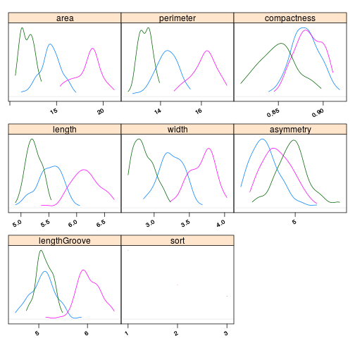
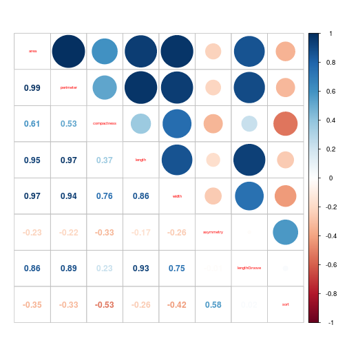

```r
library("knitr")
library("e1071")
library("lattice")
library("corrplot")
library("MASS")
```

Готовим данные


```r
data.seeds <- read.table("../data/seeds_dataset.txt")
names(data.seeds)<-c('area','perimeter','compactness','length','width','asymmetry','lengthGroove','sort')
summary(data.seeds)
```

```
##       area         perimeter      compactness         length     
##  Min.   :10.59   Min.   :12.41   Min.   :0.8081   Min.   :4.899  
##  1st Qu.:12.27   1st Qu.:13.45   1st Qu.:0.8569   1st Qu.:5.262  
##  Median :14.36   Median :14.32   Median :0.8734   Median :5.524  
##  Mean   :14.85   Mean   :14.56   Mean   :0.8710   Mean   :5.629  
##  3rd Qu.:17.30   3rd Qu.:15.71   3rd Qu.:0.8878   3rd Qu.:5.980  
##  Max.   :21.18   Max.   :17.25   Max.   :0.9183   Max.   :6.675  
##      width         asymmetry       lengthGroove        sort  
##  Min.   :2.630   Min.   :0.7651   Min.   :4.519   Min.   :1  
##  1st Qu.:2.944   1st Qu.:2.5615   1st Qu.:5.045   1st Qu.:1  
##  Median :3.237   Median :3.5990   Median :5.223   Median :2  
##  Mean   :3.259   Mean   :3.7002   Mean   :5.408   Mean   :2  
##  3rd Qu.:3.562   3rd Qu.:4.7687   3rd Qu.:5.877   3rd Qu.:3  
##  Max.   :4.033   Max.   :8.4560   Max.   :6.550   Max.   :3
```

Строим графики


```r
marginal.plot(data.seeds, data=data.seeds, groups = sort)
```

 

```r
splom(~data.seeds, data.seeds,upper.panel=function(x, y, ...) { panel.xyplot(x, y, ...); panel.loess(x, y, ..., col='red') },lower.panel=function(x, y, ...) { },
pscale=0, varname.cex=0.7, par.settings=simpleTheme(pch=13, cex=0.1))
```

 

```r
corrplot.mixed(cor(data.seeds), tl.cex=0.5)
```

 

Делим выборку


```r
data.seeds$sort <- as.factor(data.seeds$sort)
idx_ <- sample(nrow(data.seeds), size = nrow(data.seeds) * 0.6)
data.seeds.train <- data.seeds[idx_,]
data.seeds.test <- data.seeds[-idx_,]
```

строим модели

```r
lda(sort ~ ., data = data.seeds)
```

```
## Call:
## lda(sort ~ ., data = data.seeds)
## 
## Prior probabilities of groups:
##         1         2         3 
## 0.3333333 0.3333333 0.3333333 
## 
## Group means:
##       area perimeter compactness   length    width asymmetry lengthGroove
## 1 14.33443  14.29429   0.8800700 5.508057 3.244629  2.667403     5.087214
## 2 18.33429  16.13571   0.8835171 6.148029 3.677414  3.644800     6.020600
## 3 11.87386  13.24786   0.8494086 5.229514 2.853771  4.788400     5.116400
## 
## Coefficients of linear discriminants:
##                      LD1         LD2
## area         -0.42377861   4.1953167
## perimeter     3.79919995  -8.5057958
## compactness   5.92772810 -86.9823024
## length       -5.98819597  -7.8306747
## width         0.03704822   0.7141043
## asymmetry    -0.04504722   0.3212538
## lengthGroove  3.11807592   6.9138493
## 
## Proportion of trace:
##    LD1    LD2 
## 0.6814 0.3186
```

```r
tune(lda, sort ~ ., data = data.seeds, prior = c (1/3,1/3,1/3),predict.func =  function(...) predict(...)$class)
```

```
## 
## Error estimation of 'lda' using 10-fold cross validation: 0.03333333
```

В описании данных сказано, что компактность вычисляется из других измерений, так что уберём её. Так же уберём ассиметрию, т.к. сорта по ней смешанны


```r
data.seeds.formula <- sort ~ area+perimeter+length+width+lengthGroove
lda(data.seeds.formula, data = data.seeds)
```

```
## Call:
## lda(data.seeds.formula, data = data.seeds)
## 
## Prior probabilities of groups:
##         1         2         3 
## 0.3333333 0.3333333 0.3333333 
## 
## Group means:
##       area perimeter   length    width lengthGroove
## 1 14.33443  14.29429 5.508057 3.244629     5.087214
## 2 18.33429  16.13571 6.148029 3.677414     6.020600
## 3 11.87386  13.24786 5.229514 2.853771     5.116400
## 
## Coefficients of linear discriminants:
##                     LD1       LD2
## area          0.1490394 -1.425240
## perimeter    -3.2701860  2.569882
## length        6.3062390  7.278134
## width        -0.1084264  4.429900
## lengthGroove -3.2999289 -8.332069
## 
## Proportion of trace:
##    LD1    LD2 
## 0.7765 0.2235
```

```r
tune(lda, data.seeds.formula , data = data.seeds, prior = c (1/3,1/3,1/3),predict.func =  function(...) predict(...)$class)
```

```
## 
## Error estimation of 'lda' using 10-fold cross validation: 0.04285714
```

Байес


```r
naiveBayes(data.seeds.formula, data = data.seeds)
```

```
## 
## Naive Bayes Classifier for Discrete Predictors
## 
## Call:
## naiveBayes.default(x = X, y = Y, laplace = laplace)
## 
## A-priori probabilities:
## Y
##         1         2         3 
## 0.3333333 0.3333333 0.3333333 
## 
## Conditional probabilities:
##    area
## Y       [,1]      [,2]
##   1 14.33443 1.2157036
##   2 18.33429 1.4394963
##   3 11.87386 0.7230036
## 
##    perimeter
## Y       [,1]      [,2]
##   1 14.29429 0.5765831
##   2 16.13571 0.6169950
##   3 13.24786 0.3401956
## 
##    length
## Y       [,1]      [,2]
##   1 5.508057 0.2315080
##   2 6.148029 0.2681911
##   3 5.229514 0.1380152
## 
##    width
## Y       [,1]      [,2]
##   1 3.244629 0.1776155
##   2 3.677414 0.1855391
##   3 2.853771 0.1475161
## 
##    lengthGroove
## Y       [,1]      [,2]
##   1 5.087214 0.2636987
##   2 6.020600 0.2539338
##   3 5.116400 0.1620683
```

```r
tune(naiveBayes, data.seeds.formula, data = data.seeds, prior = c (1/3,1/3,1/3),predict.func =  function(...) predict(...))
```

```
## 
## Error estimation of 'naiveBayes' using 10-fold cross validation: 0.1190476
```
плохо

Мультиномиальная регрессия


```r
multinom(data.seeds.formula, data = data.seeds, trace=FALSE)
```

```
## Call:
## multinom(formula = data.seeds.formula, data = data.seeds, trace = FALSE)
## 
## Coefficients:
##   (Intercept)      area perimeter    length    width lengthGroove
## 2   -1.608193  5.992711 16.520783 -91.72464 -34.4137     54.66936
## 3  -51.504974 -7.049581  5.528678 -14.04853  15.7584     18.53710
## 
## Residual Deviance: 35.1289 
## AIC: 59.1289
```

```r
tune(multinom, data.seeds.formula, data = data.seeds, prior = c (1/3,1/3,1/3),predict.func =  function(...) predict(...), maxit = 2000, trace=FALSE)
```

```
## 
## Error estimation of 'multinom' using 10-fold cross validation: 0.05714286
```
лучше.

Используем aic для отбора признаков и прогоним ещё раз все модели


```r
method.trained<-multinom(data.seeds.formula, data = data.seeds.train, maxit = 2000, trace=FALSE)
data.seeds.formula<-as.formula(stepAIC(method.trained))
```

```
## Start:  AIC=31.42
## sort ~ area + perimeter + length + width + lengthGroove
## 
##                Df    AIC
## - width         2 27.848
## - area          2 28.507
## - perimeter     2 28.579
## <none>            31.423
## - length        2 45.736
## - lengthGroove  2 92.981
## 
## Step:  AIC=27.85
## sort ~ area + perimeter + length + lengthGroove
## 
##                Df    AIC
## - area          2 25.694
## - perimeter     2 25.835
## <none>            27.848
## - length        2 46.207
## - lengthGroove  2 88.325
## 
## Step:  AIC=25.69
## sort ~ perimeter + length + lengthGroove
## 
##                Df    AIC
## <none>            25.694
## - perimeter     2 39.534
## - length        2 46.387
## - lengthGroove  2 88.076
```

```r
lda(data.seeds.formula , data = data.seeds)
```

```
## Call:
## lda(data.seeds.formula, data = data.seeds)
## 
## Prior probabilities of groups:
##         1         2         3 
## 0.3333333 0.3333333 0.3333333 
## 
## Group means:
##   perimeter   length lengthGroove
## 1  14.29429 5.508057     5.087214
## 2  16.13571 6.148029     6.020600
## 3  13.24786 5.229514     5.116400
## 
## Coefficients of linear discriminants:
##                    LD1        LD2
## perimeter     2.898538 -0.9416926
## length       -6.106849 -6.7552073
## lengthGroove  3.312739  8.7655896
## 
## Proportion of trace:
##    LD1    LD2 
## 0.7831 0.2169
```

```r
tune(lda, data.seeds.formula , data = data.seeds, prior = c (1/3,1/3,1/3),predict.func =  function(...) predict(...)$class)
```

```
## 
## Error estimation of 'lda' using 10-fold cross validation: 0.03809524
```

```r
naiveBayes(data.seeds.formula, data = data.seeds)
```

```
## 
## Naive Bayes Classifier for Discrete Predictors
## 
## Call:
## naiveBayes.default(x = X, y = Y, laplace = laplace)
## 
## A-priori probabilities:
## Y
##         1         2         3 
## 0.3333333 0.3333333 0.3333333 
## 
## Conditional probabilities:
##    perimeter
## Y       [,1]      [,2]
##   1 14.29429 0.5765831
##   2 16.13571 0.6169950
##   3 13.24786 0.3401956
## 
##    length
## Y       [,1]      [,2]
##   1 5.508057 0.2315080
##   2 6.148029 0.2681911
##   3 5.229514 0.1380152
## 
##    lengthGroove
## Y       [,1]      [,2]
##   1 5.087214 0.2636987
##   2 6.020600 0.2539338
##   3 5.116400 0.1620683
```

```r
tune(naiveBayes, data.seeds.formula, data = data.seeds, prior = c (1/3,1/3,1/3),predict.func =  function(...) predict(...))
```

```
## 
## Error estimation of 'naiveBayes' using 10-fold cross validation: 0.0952381
```

```r
multinom(data.seeds.formula, data = data.seeds, trace=FALSE)
```

```
## Call:
## multinom(formula = data.seeds.formula, data = data.seeds, trace = FALSE)
## 
## Coefficients:
##   (Intercept) perimeter    length lengthGroove
## 2   -75.35120 11.303599 -59.07156     44.15276
## 3    46.68444 -4.906493 -16.79397     21.64573
## 
## Residual Deviance: 41.41417 
## AIC: 57.41417
```

```r
tune(multinom, data.seeds.formula, data = data.seeds, prior = c (1/3,1/3,1/3),predict.func =  function(...) predict(...), trace=FALSE)
```

```
## 
## Error estimation of 'multinom' using 10-fold cross validation: 0.04761905
```
Никаких кардинальных изменений не наблюдается.
