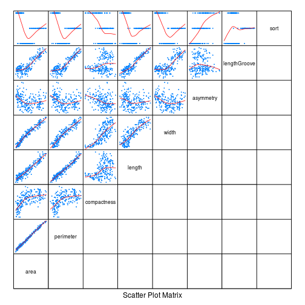

```r
library(lattice)
library(latticeExtra)
library(corrplot)
library(MASS)
library(e1071)
library(ROCR)
```

```
## Error in library(ROCR): there is no package called 'ROCR'
```

```r
library(nnet)
```

Готовим данные


```r
data.seeds <- read.table("../data/seeds_dataset.txt")
names(data.seeds)<-c('area','perimeter','compactness','length','width','asymmetry','lengthGroove','sort')
summary(data.seeds)
```

```
##       area         perimeter      compactness         length     
##  Min.   :10.59   Min.   :12.41   Min.   :0.8081   Min.   :4.899  
##  1st Qu.:12.27   1st Qu.:13.45   1st Qu.:0.8569   1st Qu.:5.262  
##  Median :14.36   Median :14.32   Median :0.8734   Median :5.524  
##  Mean   :14.85   Mean   :14.56   Mean   :0.8710   Mean   :5.629  
##  3rd Qu.:17.30   3rd Qu.:15.71   3rd Qu.:0.8878   3rd Qu.:5.980  
##  Max.   :21.18   Max.   :17.25   Max.   :0.9183   Max.   :6.675  
##      width         asymmetry       lengthGroove        sort  
##  Min.   :2.630   Min.   :0.7651   Min.   :4.519   Min.   :1  
##  1st Qu.:2.944   1st Qu.:2.5615   1st Qu.:5.045   1st Qu.:1  
##  Median :3.237   Median :3.5990   Median :5.223   Median :2  
##  Mean   :3.259   Mean   :3.7002   Mean   :5.408   Mean   :2  
##  3rd Qu.:3.562   3rd Qu.:4.7687   3rd Qu.:5.877   3rd Qu.:3  
##  Max.   :4.033   Max.   :8.4560   Max.   :6.550   Max.   :3
```

Строим графики


```r
marginal.plot(data.seeds, data=data.seeds, groups = sort)
```

 

```r
splom(~data.seeds, data.seeds,upper.panel=function(x, y, ...) { panel.xyplot(x, y, ...); panel.loess(x, y, ..., col='red') },lower.panel=function(x, y, ...) { },
pscale=0, varname.cex=0.7, par.settings=simpleTheme(pch=13, cex=0.1))
```

 

```r
corrplot.mixed(cor(data.seeds), tl.cex=0.5)
```

 

Делим выборку


```r
data.seeds$sort <- as.factor(data.seeds$sort)
idx_ <- sample(nrow(data.seeds), size = nrow(data.seeds) * 0.6)
data.seeds.train <- data.seeds[idx_,]
data.seeds.test <- data.seeds[-idx_,]
```

строим модели

```r
lda(sort ~ ., data = data.seeds)
```

```
## Call:
## lda(sort ~ ., data = data.seeds)
## 
## Prior probabilities of groups:
##         1         2         3 
## 0.3333333 0.3333333 0.3333333 
## 
## Group means:
##       area perimeter compactness   length    width asymmetry lengthGroove
## 1 14.33443  14.29429   0.8800700 5.508057 3.244629  2.667403     5.087214
## 2 18.33429  16.13571   0.8835171 6.148029 3.677414  3.644800     6.020600
## 3 11.87386  13.24786   0.8494086 5.229514 2.853771  4.788400     5.116400
## 
## Coefficients of linear discriminants:
##                      LD1         LD2
## area         -0.42377861   4.1953167
## perimeter     3.79919995  -8.5057958
## compactness   5.92772810 -86.9823024
## length       -5.98819597  -7.8306747
## width         0.03704822   0.7141043
## asymmetry    -0.04504722   0.3212538
## lengthGroove  3.11807592   6.9138493
## 
## Proportion of trace:
##    LD1    LD2 
## 0.6814 0.3186
```

```r
tune(lda, sort ~ ., data = data.seeds, prior = c (1/3,1/3,1/3),predict.func =  function(...) predict(...)$class)
```

```
## 
## Error estimation of 'lda' using 10-fold cross validation: 0.03333333
```

В описании данных сказано, что компактность вычисляется из других измерений, так что уберём её. Так же уберём ассиметрию, т.к. сорта по ней смешанны


```r
data.seeds.formula <- sort ~ area+perimeter+length+width+lengthGroove
lda(data.seeds.formula, data = data.seeds)
```

```
## Call:
## lda(data.seeds.formula, data = data.seeds)
## 
## Prior probabilities of groups:
##         1         2         3 
## 0.3333333 0.3333333 0.3333333 
## 
## Group means:
##       area perimeter   length    width lengthGroove
## 1 14.33443  14.29429 5.508057 3.244629     5.087214
## 2 18.33429  16.13571 6.148029 3.677414     6.020600
## 3 11.87386  13.24786 5.229514 2.853771     5.116400
## 
## Coefficients of linear discriminants:
##                     LD1       LD2
## area          0.1490394 -1.425240
## perimeter    -3.2701860  2.569882
## length        6.3062390  7.278134
## width        -0.1084264  4.429900
## lengthGroove -3.2999289 -8.332069
## 
## Proportion of trace:
##    LD1    LD2 
## 0.7765 0.2235
```

```r
tune(lda, data.seeds.formula , data = data.seeds, prior = c (1/3,1/3,1/3),predict.func =  function(...) predict(...)$class)
```

```
## 
## Error estimation of 'lda' using 10-fold cross validation: 0.04761905
```

Байес


```r
naiveBayes(data.seeds.formula, data = data.seeds)
```

```
## 
## Naive Bayes Classifier for Discrete Predictors
## 
## Call:
## naiveBayes.default(x = X, y = Y, laplace = laplace)
## 
## A-priori probabilities:
## Y
##         1         2         3 
## 0.3333333 0.3333333 0.3333333 
## 
## Conditional probabilities:
##    area
## Y       [,1]      [,2]
##   1 14.33443 1.2157036
##   2 18.33429 1.4394963
##   3 11.87386 0.7230036
## 
##    perimeter
## Y       [,1]      [,2]
##   1 14.29429 0.5765831
##   2 16.13571 0.6169950
##   3 13.24786 0.3401956
## 
##    length
## Y       [,1]      [,2]
##   1 5.508057 0.2315080
##   2 6.148029 0.2681911
##   3 5.229514 0.1380152
## 
##    width
## Y       [,1]      [,2]
##   1 3.244629 0.1776155
##   2 3.677414 0.1855391
##   3 2.853771 0.1475161
## 
##    lengthGroove
## Y       [,1]      [,2]
##   1 5.087214 0.2636987
##   2 6.020600 0.2539338
##   3 5.116400 0.1620683
```

```r
tune(naiveBayes, data.seeds.formula, data = data.seeds, prior = c (1/3,1/3,1/3),predict.func =  function(...) predict(...))
```

```
## 
## Error estimation of 'naiveBayes' using 10-fold cross validation: 0.1142857
```
плохо

Мультиномиальная регрессия


```r
multinom(data.seeds.formula, data = data.seeds, trace=FALSE)
```

```
## Call:
## multinom(formula = data.seeds.formula, data = data.seeds, trace = FALSE)
## 
## Coefficients:
##   (Intercept)      area perimeter    length    width lengthGroove
## 2   -1.608193  5.992711 16.520783 -91.72464 -34.4137     54.66936
## 3  -51.504974 -7.049581  5.528678 -14.04853  15.7584     18.53710
## 
## Residual Deviance: 35.1289 
## AIC: 59.1289
```

```r
tune(multinom, data.seeds.formula, data = data.seeds, prior = c (1/3,1/3,1/3),predict.func =  function(...) predict(...), maxit = 2000, trace=FALSE)
```

```
## 
## Error estimation of 'multinom' using 10-fold cross validation: 0.04285714
```
лучше.

Используем aic для отбора признаков и прогоним ещё раз все модели


```r
method.trained<-multinom(data.seeds.formula, data = data.seeds.train, maxit = 2000, trace=FALSE)
data.seeds.formula<-as.formula(stepAIC(method.trained))
```

```
## Start:  AIC=40.84
## sort ~ area + perimeter + length + width + lengthGroove
## 
##                Df    AIC
## - width         2 38.281
## - perimeter     2 40.142
## <none>            40.837
## - length        2 42.375
## - area          2 42.648
## - lengthGroove  2 89.956
## 
## Step:  AIC=38.28
## sort ~ area + perimeter + length + lengthGroove
## 
##                Df    AIC
## - perimeter     2 37.439
## <none>            38.281
## - area          2 38.827
## - length        2 42.043
## - lengthGroove  2 85.755
## 
## Step:  AIC=37.44
## sort ~ area + length + lengthGroove
## 
##                Df    AIC
## <none>            37.439
## - area          2 43.227
## - length        2 47.229
## - lengthGroove  2 86.925
```

```r
lda(data.seeds.formula , data = data.seeds)
```

```
## Call:
## lda(data.seeds.formula, data = data.seeds)
## 
## Prior probabilities of groups:
##         1         2         3 
## 0.3333333 0.3333333 0.3333333 
## 
## Group means:
##       area   length lengthGroove
## 1 14.33443 5.508057     5.087214
## 2 18.33429 6.148029     6.020600
## 3 11.87386 5.229514     5.116400
## 
## Coefficients of linear discriminants:
##                     LD1        LD2
## area          0.9061629 -0.3063793
## length       -3.7426372 -7.5722292
## lengthGroove  3.4707254  8.7175325
## 
## Proportion of trace:
##    LD1    LD2 
## 0.7751 0.2249
```

```r
tune(lda, data.seeds.formula , data = data.seeds, prior = c (1/3,1/3,1/3),predict.func =  function(...) predict(...)$class)
```

```
## 
## Error estimation of 'lda' using 10-fold cross validation: 0.04285714
```

```r
naiveBayes(data.seeds.formula, data = data.seeds)
```

```
## 
## Naive Bayes Classifier for Discrete Predictors
## 
## Call:
## naiveBayes.default(x = X, y = Y, laplace = laplace)
## 
## A-priori probabilities:
## Y
##         1         2         3 
## 0.3333333 0.3333333 0.3333333 
## 
## Conditional probabilities:
##    area
## Y       [,1]      [,2]
##   1 14.33443 1.2157036
##   2 18.33429 1.4394963
##   3 11.87386 0.7230036
## 
##    length
## Y       [,1]      [,2]
##   1 5.508057 0.2315080
##   2 6.148029 0.2681911
##   3 5.229514 0.1380152
## 
##    lengthGroove
## Y       [,1]      [,2]
##   1 5.087214 0.2636987
##   2 6.020600 0.2539338
##   3 5.116400 0.1620683
```

```r
tune(naiveBayes, data.seeds.formula, data = data.seeds, prior = c (1/3,1/3,1/3),predict.func =  function(...) predict(...))
```

```
## 
## Error estimation of 'naiveBayes' using 10-fold cross validation: 0.09047619
```

```r
multinom(data.seeds.formula, data = data.seeds, trace=FALSE)
```

```
## Call:
## multinom(formula = data.seeds.formula, data = data.seeds, trace = FALSE)
## 
## Coefficients:
##   (Intercept)      area   length lengthGroove
## 2   -17.05763  5.839609 -74.2517     63.07123
## 3    22.77605 -1.846672 -18.8076     19.96447
## 
## Residual Deviance: 39.80399 
## AIC: 55.80399
```

```r
tune(multinom, data.seeds.formula, data = data.seeds, prior = c (1/3,1/3,1/3),predict.func =  function(...) predict(...), trace=FALSE)
```

```
## 
## Error estimation of 'multinom' using 10-fold cross validation: 0.06666667
```
Никаких кардинальных изменений не наблюдается.

Попробуем svm


```r
tn.svm.linear <- tune.svm(sort ~ ., data = data.seeds, kernel = "linear", cost = 2^(-5:15))
tn.svm.linear
```

```
## 
## Parameter tuning of 'svm':
## 
## - sampling method: 10-fold cross validation 
## 
## - best parameters:
##  cost
##   512
## 
## - best performance: 0.04285714
```

```r
table(actual = data.seeds$sort, predicted = predict(tn.svm.linear$best.model))
```

```
##       predicted
## actual  1  2  3
##      1 69  0  1
##      2  0 70  0
##      3  1  0 69
```

```r
xyplot(tn.svm.linear$performances[, "error"] ~ log(tn.svm.linear$performances[, "cost"]), type="b")
```

 


```r
tn.svm.polynomial <- tune.svm(sort ~ ., data = data.seeds, kernel = "polynomial", cost = 2^(-5:15), degree= (1:5))
tn.svm.polynomial
```

```
## 
## Parameter tuning of 'svm':
## 
## - sampling method: 10-fold cross validation 
## 
## - best parameters:
##  degree  cost
##       1 16384
## 
## - best performance: 0.03333333
```

```r
table(actual = data.seeds$sort, predicted = predict(tn.svm.polynomial$best.model))
```

```
##       predicted
## actual  1  2  3
##      1 69  0  1
##      2  0 70  0
##      3  1  0 69
```

```r
xyplot(tn.svm.polynomial$performances[, "error"] ~ log(tn.svm.polynomial$performances[, "cost"]), groups = tn.svm.polynomial$performances[, "degree"] , type="b", auto.key=list(title="degree", corner=c(0.95,1), lines=TRUE))
```

 


```r
tn.svm.radial <- tune(svm, sort ~ ., data = data.seeds, ranges=list( cost = 2^(-10:20), gamma = (10^(-5:5))/ncol(data.seeds)), kernel = "radial")
tn.svm.radial
```

```
## 
## Parameter tuning of 'svm':
## 
## - sampling method: 10-fold cross validation 
## 
## - best parameters:
##  cost  gamma
##  8192 0.0125
## 
## - best performance: 0.02857143
```

```r
table(actual = data.seeds$sort, predicted = predict(tn.svm.radial$best.model))
```

```
##       predicted
## actual  1  2  3
##      1 70  0  0
##      2  0 70  0
##      3  0  0 70
```

```r
plot(tn.svm.radial, transform.x=log2, transform.y=log10)
```

 
