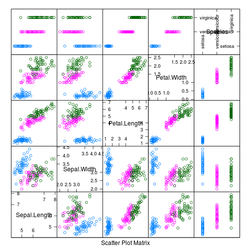
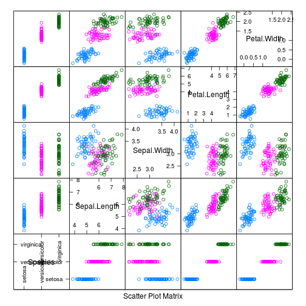

```r
library(lattice)
library(latticeExtra)
library(corrplot)
library(MASS)
library(e1071)
library(nnet)
library(boot)
library(stats)
library(mvtnorm)
```

Вспомогательная функция , которая отбирает size элементов, берёт среднее для каждого параметра и прибавляет вектор случайных значений, имеющий нормальное распределение с посчитанной заранее матрицей ковариации.

```r
make.data <- function(data, groups, model, size = nrow(data), groups.name = "Species") {
  ind <- sample(seq_along(levels(groups)), size = size, replace = TRUE)
  res <- data.frame(name = factor(levels(groups)[ind], levels = levels(groups)))
  names(res) <- groups.name
  mx <- model$means[ind,]
  mx <- mx + rmvnorm(nrow(mx), sigma = model$cov)
  colnames(mx) <- colnames(model$cov)
  res <- cbind(res, as.data.frame(mx))
  rownames(res) <- NULL
  res
}
```


```r
model <- (function(data, groups) {
  data  <- as.matrix(data)
  means <- aggregate(data, list(groups = groups), mean)
  data  <- data - as.matrix(means[match(groups, means$groups), -1])
  list(cov = cov(data), means = means[,-1, drop = FALSE])
})(subset(iris, select = -Species), iris$Species)
```

Строим графики, наблюдаем нагенерённые значения.


```r
res <- make.data(iris, iris$Species, model)
splom(iris, groups = iris$Species)
```

 

```r
splom(res, groups = res$Species)
```

 

Находим лучшую модель, используем её в качестве статистики для бутстрапа. В качестве генератора используем make.data


```r
my.qda <- function(x, data, ...) {
  out <- qda(x, data, ...)
  out$data <- data
  out
}

my.boot.statistic <- function(data)
    tune(my.qda, Species ~ ., data=data, predict.func=function(...) predict(...)$class, tunecontrol=tune.control(sampling="fix", fix=1/2))$best.performance

b <- boot(iris,
          my.boot.statistic,
          R=999, 
          sim="parametric",
          ran.gen=function(data, mle, ..., size=300){make.data(data, mle$groups, mle$model, ...)}, 
          mle=list(groups=iris$Species,model=model)
)

print(b)
```

```
## 
## PARAMETRIC BOOTSTRAP
## 
## 
## Call:
## boot(data = iris, statistic = my.boot.statistic, R = 999, sim = "parametric", 
##     ran.gen = function(data, mle, ..., size = 300) {
##         make.data(data, mle$groups, mle$model, ...)
##     }, mle = list(groups = iris$Species, model = model))
## 
## 
## Bootstrap Statistics :
##       original     bias    std. error
## t1* 0.01333333 0.00639306  0.01753111
```

```r
plot(b)
```

 

```r
boot.ci(b, type = "perc")
```

```
## BOOTSTRAP CONFIDENCE INTERVAL CALCULATIONS
## Based on 999 bootstrap replicates
## 
## CALL : 
## boot.ci(boot.out = b, type = "perc")
## 
## Intervals : 
## Level     Percentile     
## 95%   ( 0.0000,  0.0667 )  
## Calculations and Intervals on Original Scale
```

