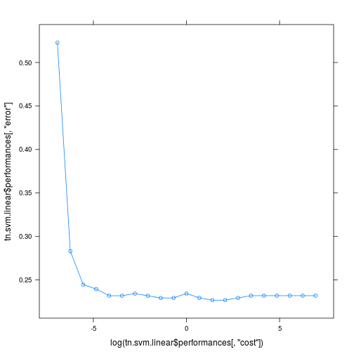
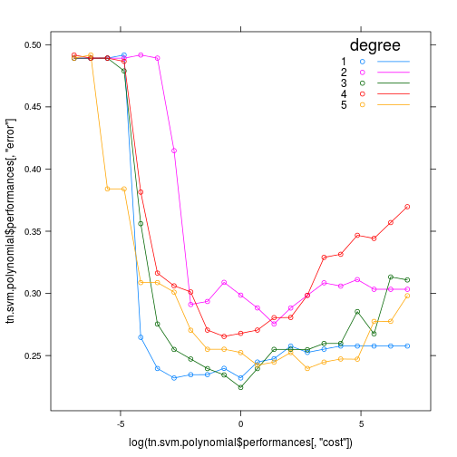
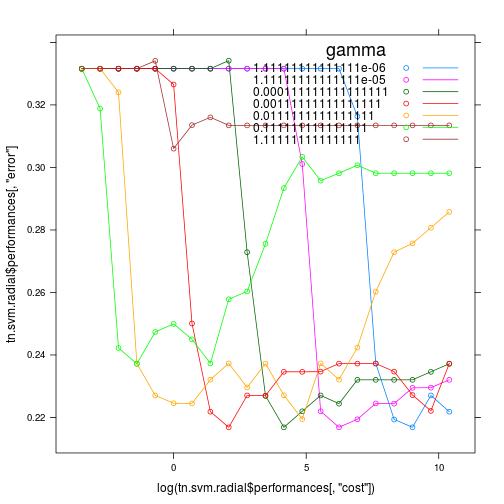

```r
library("knitr")
library("e1071")
library("lattice")
data.diabetis <- read.table("../data/Diabetis.txt", header=TRUE)
```

===========================================LINEAR=============================================

```r
tn.svm.linear <- tune.svm(diabetes ~ ., data = data.diabetis, type = "C-classification", kernel = "linear", cost = 2^(-10:10))
tn.svm.linear
```

```
## 
## Parameter tuning of 'svm':
## 
## - sampling method: 10-fold cross validation 
## 
## - best parameters:
##  cost
##   0.5
## 
## - best performance: 0.2116026
```

```r
table(actual = data.diabetis$diabetes, predicted = predict(tn.svm.linear$best.model))
```

```
##       predicted
## actual neg pos
##    neg 232  30
##    pos  56  74
```

```r
xyplot(tn.svm.linear$performances[, "error"] ~ log(tn.svm.linear$performances[, "cost"]), type="b")
```

 

===========================================POLYNOMIAL==========================================

```r
tn.svm.polynomial <- tune.svm(diabetes ~ ., data = data.diabetis, type = "C-classification", kernel = "polynomial", cost = 2^(-10:10), degree= (1:5))
tn.svm.polynomial
```

```
## 
## Parameter tuning of 'svm':
## 
## - sampling method: 10-fold cross validation 
## 
## - best parameters:
##  degree cost
##       1    1
## 
## - best performance: 0.2191667
```

```r
table(actual = data.diabetis$diabetes, predicted = predict(tn.svm.polynomial$best.model))
```

```
##       predicted
## actual neg pos
##    neg 233  29
##    pos  57  73
```

```r
xyplot(tn.svm.polynomial$performances[, "error"] ~ log(tn.svm.polynomial$performances[, "cost"]), groups = tn.svm.polynomial$performances[, "degree"] , type="b", auto.key=list(title="degree", corner=c(0.95,1), lines=TRUE))
```

 

============================================RADIAL==============================================

```r
tn.svm.radial <- tune.svm(diabetes ~ ., data = data.diabetis, type = "C-classification", kernel = "radial", cost = 2^(-5:15), gamma = (10^(-5:1))/ncol(data.diabetis))
tn.svm.radial
```

```
## 
## Parameter tuning of 'svm':
## 
## - sampling method: 10-fold cross validation 
## 
## - best parameters:
##        gamma cost
##  0.001111111    8
## 
## - best performance: 0.216859
```

```r
table(actual = data.diabetis$diabetes, predicted = predict(tn.svm.radial$best.model))
```

```
##       predicted
## actual neg pos
##    neg 236  26
##    pos  58  72
```

```r
xyplot(tn.svm.radial$performances[, "error"] ~ log(tn.svm.radial$performances[, "cost"]), groups = tn.svm.radial$performances[, "gamma"] , type="b", auto.key=list(title="gamma", corner=c(0.95,1), lines=TRUE))
```

 
