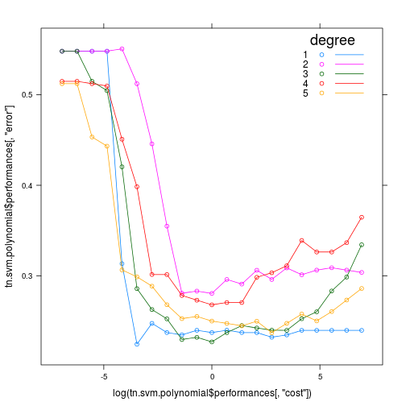

```r
library("knitr")
library("e1071")
library("lattice")
data.diabetis <- read.table("../data/Diabetis.txt", header=TRUE)
```

===========================================LINEAR=============================================

```r
tn.svm.linear <- tune(svm, diabetes ~ ., data = data.diabetis, ranges = list(cost = 2^(-10:10)), type = "C-classification", kernel = "linear", class.weights = c(neg = 0.33, pos = 0.67))
tn.svm.linear
```

```
## 
## Parameter tuning of 'svm':
## 
## - sampling method: 10-fold cross validation 
## 
## - best parameters:
##    cost
##  0.0625
## 
## - best performance: 0.2373077
```

```r
table(actual = data.diabetis$diabetes, predicted = predict(tn.svm.linear$best.model))
```

```
##       predicted
## actual neg pos
##    neg 210  52
##    pos  32  98
```

```r
xyplot(tn.svm.linear$performances[, "error"] ~ log(tn.svm.linear$performances[, "cost"]), type="b")
```

 

===========================================POLYNOMIAL==========================================

```r
tn.svm.polynomial <- tune(svm, diabetes ~ ., data = data.diabetis, ranges=list(cost = 2^(-10:10), degree= (1:5)), type = "C-classification", kernel = "polynomial", class.weights = c(neg = 0.33, pos = 0.67))
tn.svm.polynomial
```

```
## 
## Parameter tuning of 'svm':
## 
## - sampling method: 10-fold cross validation 
## 
## - best parameters:
##  cost degree
##     1      3
## 
## - best performance: 0.224359
```

```r
table(actual = data.diabetis$diabetes, predicted = predict(tn.svm.polynomial$best.model))
```

```
##       predicted
## actual neg pos
##    neg 246  16
##    pos  49  81
```

```r
xyplot(tn.svm.polynomial$performances[, "error"] ~ log(tn.svm.polynomial$performances[, "cost"]), groups = tn.svm.polynomial$performances[, "degree"] , type="b", auto.key=list(title="degree", corner=c(0.95,1), lines=TRUE))
```

 

============================================RADIAL==============================================

```r
tn.svm.radial <- tune(svm, diabetes ~ ., data = data.diabetis, ranges=list( cost = 2^(-5:15), gamma = (10^(-5:1))/ncol(data.diabetis)), type = "C-classification", kernel = "radial", class.weights = c(neg = 0.33, pos = 0.67))
tn.svm.radial
```

```
## 
## Parameter tuning of 'svm':
## 
## - sampling method: 10-fold cross validation 
## 
## - best parameters:
##  cost      gamma
##   128 0.01111111
## 
## - best performance: 0.2216026
```

```r
table(actual = data.diabetis$diabetes, predicted = predict(tn.svm.radial$best.model))
```

```
##       predicted
## actual neg pos
##    neg 213  49
##    pos  20 110
```

```r
xyplot(tn.svm.radial$performances[, "error"] ~ log(tn.svm.radial$performances[, "cost"]), groups = tn.svm.radial$performances[, "gamma"] , type="b", auto.key=list(title="gamma", corner=c(0.95,1), lines=TRUE))
```

 
