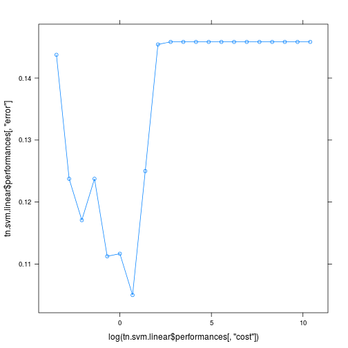
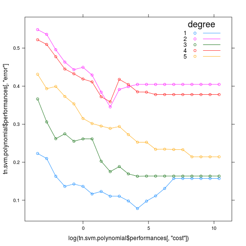
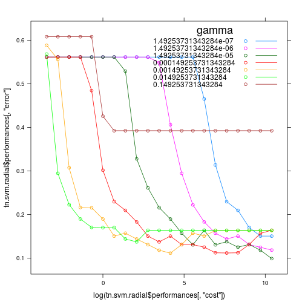

```r
library("knitr")
library("e1071")
library("lattice")
data.glaucoma <- read.table("data/GlaucomaMVF.txt", header=TRUE)
```

===========================================LINEAR=============================================

```r
tn.svm.linear <- tune.svm(Class ~ ., data = data.glaucoma, type = "C-classification", kernel = "linear", cost = 2^(-5:15))
tn.svm.linear
```

```
## 
## Parameter tuning of 'svm':
## 
## - sampling method: 10-fold cross validation 
## 
## - best parameters:
##  cost
##     2
## 
## - best performance: 0.105
```

```r
table(actual = data.glaucoma$Class, predicted = predict(tn.svm.linear$best.model))
```

```
##           predicted
## actual     glaucoma normal
##   glaucoma       75      0
##   normal          2     76
```

```r
xyplot(tn.svm.linear$performances[, "error"] ~ log(tn.svm.linear$performances[, "cost"]), type="b")
```

 
Видно, что данные почти что линейно разделимы и линейное ядро даёт очень хорший результат.

===========================================POLYNOMIAL==========================================

```r
tn.svm.polynomial <- tune.svm(Class ~ ., data = data.glaucoma, type = "C-classification", kernel = "polynomial", cost = 2^(-5:15), degree= (1:5))
tn.svm.polynomial
```

```
## 
## Parameter tuning of 'svm':
## 
## - sampling method: 10-fold cross validation 
## 
## - best parameters:
##  degree cost
##       1   64
## 
## - best performance: 0.07791667
```

```r
table(actual = data.glaucoma$Class, predicted = predict(tn.svm.polynomial$best.model))
```

```
##           predicted
## actual     glaucoma normal
##   glaucoma       75      0
##   normal          2     76
```

```r
xyplot(tn.svm.polynomial$performances[, "error"] ~ log(tn.svm.polynomial$performances[, "cost"]), groups = tn.svm.polynomial$performances[, "degree"] , type="b", auto.key=list(title="degree", corner=c(0.95,1), lines=TRUE))
```

 
Наилучшая степень-1. Это подтверждает то, что данные почти что линейно разделимы.
При больших степенях-overfitting.
Так же интересно то, что полиномы нечётной степени подходят лучше полиномов чётной степени.

============================================RADIAL==============================================

```r
tn.svm.radial <- tune.svm(Class ~ ., data = data.glaucoma, type = "C-classification", kernel = "radial", cost = 2^(-5:15), gamma = (10^(-5:1))/ncol(data.glaucoma))
tn.svm.radial
```

```
## 
## Parameter tuning of 'svm':
## 
## - sampling method: 10-fold cross validation 
## 
## - best parameters:
##         gamma  cost
##  1.492537e-05 32768
## 
## - best performance: 0.09875
```

```r
table(actual = data.glaucoma$Class, predicted = predict(tn.svm.radial$best.model))
```

```
##           predicted
## actual     glaucoma normal
##   glaucoma       75      0
##   normal          2     76
```

```r
xyplot(tn.svm.radial$performances[, "error"] ~ log(tn.svm.radial$performances[, "cost"]), groups = tn.svm.radial$performances[, "gamma"] , type="b", auto.key=list(title="gamma", corner=c(0.95,1), lines=TRUE))
```

 
Ничего особо интересного, видно что уменьшение гаммы в разумных пределах ни на что не влияет, а её увеличение приводит к overfitting-у.
