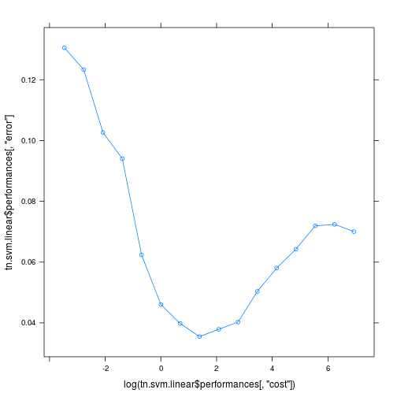
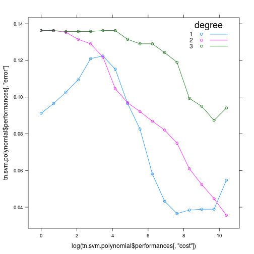

```r
library("knitr")
library("e1071")
library("lattice")
data.elements <- read.csv("data/data.csv", header=TRUE)
columns_to_drop <- c("url")
data.elements <- data.elements[,!(names(data.elements) %in% columns_to_drop)]
data.elements$has_content <- data.elements$has_content <- factor(data.elements$has_content)
```

===========================================LINEAR=============================================

```r
tn.svm.linear <- tune(svm, has_content ~ ., data = data.elements, ranges = list(cost = 2^(-5:10)), type = "C-classification", kernel = "linear", class.weights = c('1'=(1798-286)/1798,'0'= 286/1798))
tn.svm.linear
```

```
## 
## Parameter tuning of 'svm':
## 
## - sampling method: 10-fold cross validation 
## 
## - best parameters:
##  cost
##     4
## 
## - best performance: 0.03549898
```

```r
table(actual = data.elements$has_content, predicted = predict(tn.svm.linear$best.model))
```

```
##       predicted
## actual    0    1
##      0 1769   29
##      1    7  279
```

```r
xyplot(tn.svm.linear$performances[, "error"] ~ log(tn.svm.linear$performances[, "cost"]), type="b")
```

 

===========================================POLYNOMIAL==========================================

```r
tn.svm.polynomial <- tune(svm, has_content ~ ., data = data.elements, ranges=list(cost = 2^(0:15), degree= (1:3)), type = "C-classification", kernel = "polynomial", class.weights = c('1'=(1798-286)/1798,'0'= 286/1798))
tn.svm.polynomial
```

```
## 
## Parameter tuning of 'svm':
## 
## - sampling method: 10-fold cross validation 
## 
## - best parameters:
##   cost degree
##  32768      2
## 
## - best performance: 0.03553138
```

```r
table(actual = data.elements$has_content, predicted = predict(tn.svm.polynomial$best.model))
```

```
##       predicted
## actual    0    1
##      0 1769   29
##      1    4  282
```

```r
xyplot(tn.svm.polynomial$performances[, "error"] ~ log(tn.svm.polynomial$performances[, "cost"]), groups = tn.svm.polynomial$performances[, "degree"] , type="b", auto.key=list(title="degree", corner=c(0.95,1), lines=TRUE))
```

 

============================================RADIAL==============================================

```r
tn.svm.radial <- tune(svm, has_content ~ ., data = data.elements, ranges=list( cost = 2^(0:15), gamma = (10^(-5:0))/ncol(data.elements)), type = "C-classification", kernel = "radial", class.weights = c('1'=(1798-286)/1798,'0'= 286/1798))
tn.svm.radial
```

```
## 
## Parameter tuning of 'svm':
## 
## - sampling method: 10-fold cross validation 
## 
## - best parameters:
##  cost        gamma
##  8192 0.0004545455
## 
## - best performance: 0.02638734
```

```r
table(actual = data.elements$has_content, predicted = predict(tn.svm.radial$best.model))
```

```
##       predicted
## actual    0    1
##      0 1773   25
##      1    1  285
```

```r
plot(tn.svm.radial, transform.x=log2, transform.y=log10)
```

 
